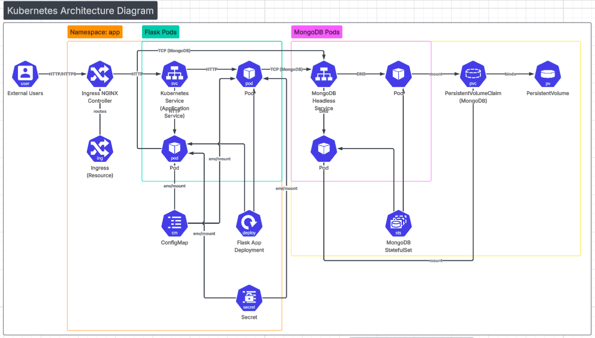
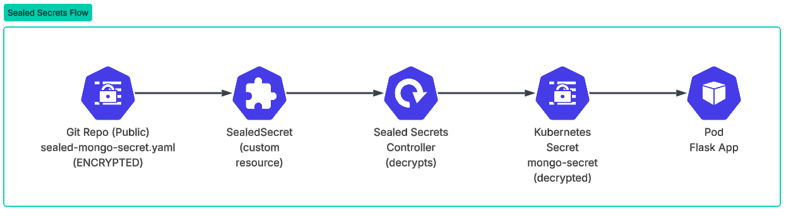
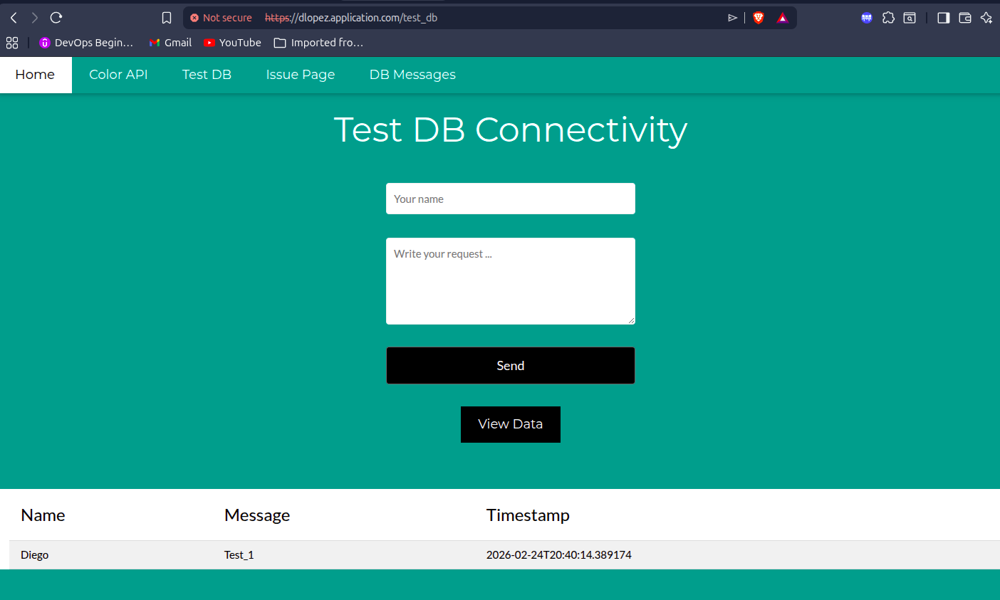

# Kubernetes 3-Tier Application Deployment
## 📌 Project Overview

This project contains a complete ***Kubernetes deployment of a 3-tier web application***:

* **Presentation Layer**: NGINX Ingress for external access
* **Application Layer**: Flask Python web application
* **Data Layer**: MongoDB database with persistent storage

The application ***allows users to view and interact with a web interface*** that displays dynamic content, with the ability to change the background color via configuration.

This project is designed as a ***portfolio‑grade DevOps project***, aligned with ***real industry practices*** and expectations for ***DevOps Junior / Associate roles***.

---

## 📖 Table of Contents

- [Architecture](#-architecture)
- [Tech Stack](#-tech-stack)
- [Project Structure](#-project-structure)
- [Security: Sealed Secrets Deep Dive](#-security-sealed-secrets-deep-dive)
- [Quick Start Guide](#-quick-start-guide)
- [Application Endpoints](#-application-endpoints)
- [Configuration Management](#-configuration-management)
- [Key Kubernetes Features](#-key-kubernetes-features-explained)
- [Resource Allocation](#-resource-allocation)
- [Testing Strategies](#-testing-strategies)
- [Troubleshooting Guide](#-troubleshooting-guide)
- [Production Readiness](#-production-readiness-checklist)
- [Additional Resources](#-additional-resources)
- [Author](#-author)

---

## 🧱 Architecture



---

## 🧰 Tech Stack

|       Category       |          Technologies               |
|----------------------|-------------------------------------|
| **Containerization** |      Docker, Docker Compose         |
| **Orchestration**    |    Kubernetes (Minikube), kubectl   |
| **Application**      |     Python, Flask, Gunicorn         |
| **Database**         |     MongoDB, Persistent Volumes     |
| **Networking**       |    NGINX Ingress, Services          |
| **Security**         |     Sealed Secrets, RBAC, Base64    |
| **Testing**          |   hadolint, jq, Custom test suite   |

---

## 📂 Project Structure

```bash
.
├── application                            # Flask application source code
│   ├── app.py                             # Main Flask application
│   ├── color_list.txt                     # Available colors
│   ├── config.py                          
│   ├── Dockerfile                         # Docker image definition
│   ├── forms.py                           # Form definitions
│   ├── README.md                          # Description Flask Color App
│   ├── requirements.txt                   # Python dependencies
│   ├── static                             # Static files (CSS)    
│   │   └── styles.css
│   └── templates                          # HTML templates
│       ├── form_test.html                 # Test DB page
│       └── start.html                     # Home page
|
├── utils/                                 # Utility scripts
│   ├── local_minikube_preparation.sh      # Namespace setup
│   ├── Vagrantfile                        # VM provisioning
│   └── vagrant_provision.sh               # Provisioning script
│
├── sealed-mongo-secret.yaml               # ENCRYPTED MongoDB credentials (SAFE FOR GIT!)
├── manifest.yml                           # Main Kubernetes manifest
├── docker-compose.yaml                    # Local development setup
├── README.md                              # This documentation
└── requirements.txt                       # Global dependencies
```

---

## 🔐 SECURITY: Sealed Secrets Deep Dive
### Why Base64 Is NOT Enough
In Kubernetes, Secrets are stored in **base64**, which is **NOT encryption** - it's just encoding:

```bash
# This is NOT secure - anyone can decode it
echo "cm9vdA==" | base64 -d  # Output: root (visible to everyone)
```

**The problem:** You cannot commit secrets to Git because they would be exposed publicly

**The solution:** Sealed Secrets



## 📦 Secret Files in This Repository

|         File            |       Content         |      Git-Safe?         |           Included?       |
|-------------------------|:---------------------:|:----------------------:|:-------------------------:|
|sealed-mongo-secret.yaml	| Encrypted secrets with Sealed Secrets	| ✅ YES	|        ✅ In repo         |
|     mongo-secret.yaml 	|       Plain text secrets            	| ❌ NO	|   ❌ Ignored (.gitignore) |
| sealed-secrets-cert.pem |	  Private cluster certificate	        | ❌ NO	|         ❌ Ignore         |

---

## 🚀 Step-by-Step: Implementing Sealed Secrets
### Step 1: Install The Controller in Your Cluster

```bash
# Install Sealed Secrets controller
kubectl apply -f https://github.com/bitnami-labs/sealed-secrets/releases/download/v0.18.0/controller.yaml

# Verify installation
kubectl get pods -n kube-system | grep sealed
```

### Step 2: Install Kubeseal (Local client)

```bash
# Linux
wget https://github.com/bitnami-labs/sealed-secrets/releases/download/v0.18.0/kubeseal-0.18.0-linux-amd64.tar.gz
tar xf kubeseal-0.18.0-linux-amd64.tar.gz
sudo install -m 755 kubeseal /usr/local/bin/kubeseal

# macOS
brew install kubeseal

# Windows (with chocolatey)
choco install kubeseal
```

### Step 3: Create a New Encrypted Secret

```bash
# 1. Create plain text secret file (LOCAL ONLY)
cat <<EOF > mongo-secret.yaml
apiVersion: v1
kind: Secret
metadata:
  name: mongo
  namespace: dlopez
type: Opaque
stringData:
  MONGO_INITDB_ROOT_USERNAME: root
  MONGO_INITDB_ROOT_PASSWORD: example
EOF

# 2. Encrypt with kubeseal
kubeseal --format=yaml < mongo-secret.yaml > sealed-mongo-secret.yaml

# 3. ✅ NOW YOU CAN COMMIT sealed-mongo-secret.yaml TO GIT!
# 4. Delete the plain text secret file (SECURITY!)
rm mongo-secret.yaml
```

### Step 4: Deploy to Production

```bash
# On any cluster with the controller installed:
kubectl apply -f sealed-mongo-secret.yaml

# The controller automatically decrypts and creates:
kubectl get secret mongo -n dlopez

# Verify the pod can access the secret
kubectl exec -n dlopez deployment/application -- env | grep MONGO
```

---

## 🎯 Benefits of Sealed Secrets

|       Benefit     	|                Description                     |
|---------------------|:----------------------------------------------:|
|     🔒 Git-Safe    	| Public repositories can contain secrets safely |
|    🔄 GitOps Ready  |	    Works perfectly with ArgoCD, Flux          |
| 🔑 Simple Rotation  |	 Just re-encrypt with the same certificate     |
|   📊 Audit Trail  	|         All changes tracked in Git             |
|     ⚡ Automatic    	|  Decryption happens automatically on apply     |

---

## ⚠️ CRITICAL: Backup Your Certificate

```bash
# The certificate is UNIQUE per cluster. BACK IT UP!
kubectl get secret -n kube-system sealed-secrets-key -o yaml > sealed-secrets-backup.yaml

# Store it in a SECURE location (password manager, vault, etc.)
# If you lose it, you CANNOT decrypt existing sealed secrets!
```

---

## 🏢 Enterprise Alternatives for Production

|           Tool          	|       Best For      	|             Advantage             |
|:-------------------------:|:---------------------:|:---------------------------------:|
|       HashiCorp Vault     |	  Large enterprises 	| Advanced policies, audit logging  |
|     AWS Secrets Manager   |	   AWS Cloud	Native  |         AWS integration           |
|      Azure Key Vault    	|     Azure Cloud     	|       Azure AD integration        |
|   Google Secret Manager	  |         GCP Cloud    	|           GCP integration         |
| External Secrets Operator	|     Multi-cloud     	|     Syncs with all of the above   |

---

## 🚀 Quick Start Guide
### Prerequisites

```bash
# Install required tools
# Docker: https://docs.docker.com/get-docker/
# Minikube: https://minikube.sigs.k8s.io/docs/start/
# kubectl: https://kubernetes.io/docs/tasks/tools/

# Verify installations
docker --version
minikube version
kubectl version --client
```

### Step 1: Start Minikube and Enable Ingress

```bash
# Start Minikube
minikube start --driver=docker

# Enable NGINX Ingress
minikube addons enable ingress

# Verify Ingress controller is running
kubectl get pods -n ingress-nginx
```

### Step 2: Install Sealed Secrets Controller

```bash
# Install the controller (needed for secret decryption)
kubectl apply -f https://github.com/bitnami-labs/sealed-secrets/releases/download/v0.18.0/controller.yaml
```

### Step 3: Create Isolated Namespace

```bash
# Run the preparation script with your full name
./utils/local_minikube_preparation.sh "Diego Lopez"

# Switch to your context
kubectl config use-context minikube-dlopez

# Verify you're in the right namespace
kubectl config current-context
```

### Step 4: Build and Load Docker Image

```bash 
# Build the Flask application image
cd application
docker build -t dlopez_application:latest .

# Load image into Minikube (for imagePullPolicy: IfNotPresent)
minikube image load dlopez_application:latest

# Return to main directory
cd ..
```

### Step 5: Deploy the Application 

```bash
# Apply the encrypted secret (will be decrypted by controller)
kubectl apply -f sealed-mongo-secret.yaml

# Apply the main manifest
kubectl apply -f manifest.yml

# Watch pods come up (wait for 1/1 Running)
kubectl get pods -n dlopez -w
```

### Step 6: Access the Application 

```bash
# Get Minikube IP
minikube ip

# Add to /etc/hosts (Linux/Mac)
echo "$(minikube ip) dlopez.application.com" | sudo tee -a /etc/hosts

# For Windows (PowerShell as Administrator):
# Add-Content -Path C:\Windows\System32\drivers\etc\hosts -Value "$(minikube ip) dlopez.application.com"

# Open in browser
# http://dlopez.application.com
# http://dlopez.application.com/test_db
# http://dlopez.application.com/issue
```

You should see something like this: 


---

## 📊 Application Endpoints

|   Endpoint    |    Description         |        Expected Output          |
| ------------- |:----------------------:|:-------------------------------:|    
| /             | Home page              | Main page with teal background  |
| /color        | Color API              | JSON with current color setting |    
| /test_db      | Database test form     | Form to write data to MongoDB   | 
| /db_message   | Home page              | JSON of all stored messages     |
| /issue        | Color API              | JSON showing issue fix status   |    
| /healthz      | Database test form     | "OK" (for kubernetes)           | 
| /healthx      | Readiness probe        | "OK" (for kubernetes)           |

---

## 🔧 Configuration
### ConfigMap (Non-sensitive Configuration)

```yaml
data:
  MONGO_HOST: "mongo"        # MongoDB service name
  MONGO_PORT: "27017"        # MongoDB port
  BG_COLOR: "teal"            # Default background color
  FAIL_FLAG: "false"          # Issue page status
```

### Secret (Sensitive Data)

```yaml
data:
  MONGO_INITDB_ROOT_USERNAME: cm9vdA==  # "root" (base64 encoded)
  MONGO_INITDB_ROOT_PASSWORD: ZXhhbXBsZQ==  # "example" (base64 encoded)
```

---

## 🔍 Key Kubernetes Features Explained
### 1. Init Container - Waits for Dependencies
The application pod includes an init container that waits for MongoDB to be available:

```yaml
initContainers:
- name: wait-for-mongo
  command: ['sh', '-c', "until nslookup mongo; do echo waiting for mongo; sleep 2; done"]
```

What it does: Prevents the Flask app from starting until MongoDB is resolvable via DNS.

### 2. Health probes - Self-Healing

```yaml
livenessProbe:   # Restarts container if app hangs
  httpGet:
    path: /healthz
    port: 5000
  initialDelaySeconds: 30
  periodSeconds: 15

readinessProbe:  # Stops traffic if app isn't ready
  httpGet:
    path: /healthx
    port: 5000
  initialDelaySeconds: 15
  periodSeconds: 10
```

### 3. Persistent Storage - Data Durability
MongoDB uses persistent storage to survive pod restarts:

```yaml
volumeClaimTemplates:
- metadata:
    name: mongo-data
  spec:
    accessModes: ["ReadWriteOnce"]
    resources:
      requests:
        storage: 1Gi
```

### 4. Resource Limits - Stability

|   Component 	|CPU Request|	CPU Limit |	Memory Request	|     Memory Limit     |
|---------------|:---------:|:---------:|:---------------:|:--------------------:|
|   Flask App   |	0.2 cores	| 0.5 cores |	      64Mi      |	        128Mi        |
|    MongoDB   	| 0.2 cores	| 0.5 cores |	      128Mi     |	        256Mi        |

---

## 📈 Resource Allocation
### Application Pod

|   Resource    |      Request    |   Limit    |
| ------------- |:---------------:|:----------:|   
|    CPU        |   0.2 cores     | 0.5 cores  |
|    Memory     |   64Mi          |   128Mi    |    

### MongoDB Pod

|   Resource    |      Request    |   Limit    |
| ------------- |:---------------:|:----------:|   
|    CPU        |   0.2 cores     | 0.5 cores  |
|    Memory     |     128Mi       |   256Mi    |  
|    Storage    |      1Gi        |     -      |

---

## 🧪 Testing Stretegies
### Local Development with Docker Compose

```bash
# Start both services
docker-compose up -d

# Test the application
curl http://localhost:5000

# View logs
docker-compose logs -f

# Stop services
docker-compose down
```

### Kubernetes Validation
 
 ```bash
# Check all resources
kubectl get all,configmap,secret,ingress,pvc -n dlopez

# Check application logs
kubectl logs -n dlopez -l app=application

# Test database connectivity
curl http://dlopez.application.com/db_message

# Test issue page
curl http://dlopez.application.com/issue

# Change background color (via ConfigMap)
kubectl patch configmap application -n dlopez -p '{"data":{"BG_COLOR":"blue"}}'
kubectl rollout restart deployment application -n dlopez
 ```

### Run the Local Test Suite

```bash
# The final-check utility validates your deployment
./final-check -test-suite 'final_task' -student "Diego Lopez"
```

---

## 🐛 Troubleshooting Guide
### Common Issues and Solutions

|       Issue           |	            Symptom            	|                    Solution                       |
|:---------------------:|:-------------------------------:|:-------------------------------------------------:|
|   ErrImageNeverPull   | 	Pod stuck in ImagePullBackOff	|   minikube image load dlopez_application:latest   |
|   MongoDB OOMKilled   |	    Pod crashes with OOM	      |   Increase memory limits in StatefulSet           |
|   Pod Not Ready	0/1   |     Ready in kubectl get pods   |	    Check logs: kubectl logs -n dlopez <pod-name> |
|   Auth Failed	        |     MongoDB connection errors	  |   Verify secret values are correct                |
|   SealedSecret error	|     "Failed to decrypt"	        |   Check controller is running and certificate     |
|   Ingress Not Working |	    404 when accessing URL      |	    minikube addons enable ingress                |
|   CrashLoopBackOff	  |     Pod constantly restarting   |	    kubectl describe pod <pod-name> for events    |


### Useful Debugging Commands

```bash
# Check pod status
kubectl get pods -n dlopez

# View detailed pod info
kubectl describe pod -n dlopez -l app=application

# Follow logs in real-time
kubectl logs -n dlopez -l app=application -f

# Execute commands inside a pod
kubectl exec -n dlopez -it deployment/application -- /bin/sh

# Check cluster events
kubectl get events -n dlopez --sort-by='.lastTimestamp'

# Verify sealed secret status
kubectl get sealedsecret -n dlopez
```

---

## 📈 Production Readiness Checklist

* Sealed Secrets for Git-safe secrets
* External Secrets Manager (Vault, AWS Secrets Manager)
* Encryption at Rest for etcd
* Network Policies for pod isolation
* Horizontal Pod Autoscaling based on metrics
* CI/CD Pipeline (GitHub Actions, GitLab CI)
* Monitoring (Prometheus + Grafana)
* Logging Aggregation (ELK Stack or Loki)
* Backup & Disaster Recovery for persistent volumes
* Service Mesh (Istio, Linkerd) for advanced traffic management
* Chaos Engineering (Chaos Mesh) for resilience testing

---

## 📚 Additional Resources

* [Kubernetes Documentation](https://kubernetes.io/docs/) 
* [Flask Documentation](https://flask.palletsprojects.com/)
* [MongoDB Kubernetes Operator](https://www.mongodb.com/kubernetes)
* [Minikube Documentation](https://minikube.sigs.k8s.io/docs/)
* [Sealed Secrets GitHub](https://github.com/bitnami-labs/sealed-secrets)
* [External Secrets Operator](https://external-secrets.io/)
* [HashiCorp Vault](https://www.vaultproject.io/)
* [Prometheus](https://prometheus.io/)
* [Grafana](https://grafana.com/)
---

## 👨‍💻 Author

**Diego López Arango** - DevOps Engineer 

⭐ Don't forget to star this repo if you found it helpful!
